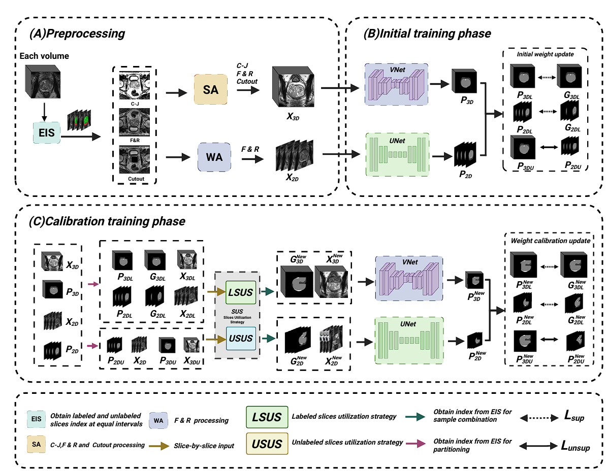

<div align="center">
<h1> Multi-Perturbation Consistency Learning for Semi-Supervised Medical Image Segmentation (JBHI 2025) </h1>
</div>


# Semi-Supervised Medical Image Segmentation via Multi-Perturbation Consistency Learning

## Background
Existing semi-supervised learning (SSL) methods primarily rely on consistency learning to enhance model performance. However, most current approaches only validate the effectiveness of consistency learning under single perturbations, while introducing multiple perturbations may lead to the failure of consistency learning and degrade model performance.

## Proposed Method
To address this issue and effectively leverage multiple perturbations for consistency learning, we propose a semi-supervised medical image segmentation method based on **multi-perturbation consistency learning**.

### Key Components:
1. **Cross-Teaching Framework**
   - Integrates sparsely annotated 3D and 2D networks
   - Introduces network perturbations through multidimensional architectures
   - Combines strong and weak data augmentation techniques to achieve input perturbations

2. **Uncertainty-Aware Correction Algorithms**
   - Two complementary algorithms targeting labeled and unlabeled data
   - Address instability issues in multi-perturbation consistency learning
   - Enhance model robustness to both labeled and unlabeled data

## Advantages
These designs effectively overcome the instability problem in multi-perturbation consistency learning while maintaining model performance.

## 1. Installation
```bash
git clone https://github.com/hai-medicallab/MPCL4SSL.git
```
This repository is based on PyTorch 2.0.1, CUDA 12.4 and Python 3.10. All experiments in our paper were conducted on NVIDIA RTX A6000 GPU with an identical experimental setting.
```

pip install -r requirements.txt
```
## 2. Dataset
Data could be got at [X](https://prostatex.grand-challenge.org/),
Then, run python script to preprocess the data.
```
python ./dataloader/X_preprocessing.py  
```
```
├── ./data
    ├── [X]
        ├── volume-01.h5
        ├── ...
        ├── train.txt
        └── test.txt

```
## 3. Usage
To train a model,
```
python ./train_X.py  # for X training 
``` 
To test a model,
```
python ./test_X.py  # for X testing
```
## Citation
If you find these projects useful, please consider citing:
```bibtex
@ARTICLE{3625190,
  author={ Zhiyuan Zhang, Yu Zhang, Jing Chen, Wenlong Feng, Zihao Zhou, Jie Zou, Uzair Aslam Bhatti,
 Gang Wang, Mengxing Huang, Zhiming Bai},
  journal={IEEE Journal of Biomedical and Health Informatics}, 
  title={Multi-Perturbation Consistency Learning for Semi-Supervised Medical Image Segmentation}, 
  year={2025},
  keywords={Semi-supervised Learning, Medical Image Segmentation,CNN,Consistency Learning},
  doi={10.1109/JBHI.2025.3625190}}
```
## Acknowledgements
Our code is largely based on [SSL4MIS](https://github.com/HiLab-git/SSL4MIS), [ABD](https://github.com/chy-upc/ABD). Thanks for these authors for their valuable work, hope our work can also contribute to related research.